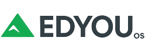

# EDYOU OS 🏔️

### **Education for You!**

**EDYOU OS** is a modern, privacy-focused Linux operating system created for schools that want to give students freedom, performance, and reliability — without the limits of traditional systems.

Built on the solid foundation of **Debian/Ubuntu LTS**, EDYOU OS delivers a clean, Windows-like interface combined with the stability, speed, and openness that only Linux can offer.

---

## 🌍 What is EDYOU OS?

EDYOU OS is designed for **education without compromise**.  
It’s a lightweight, easy-to-use system built specifically for classrooms, computer labs, and learning environments that value **privacy, simplicity, and control**.

- ⚡ **Fast and efficient** — runs smoothly on older school laptops  
- 🔒 **Privacy-first** — no telemetry, no data collection, no ads  
- 🧱 **Reliable and secure** — powered by Debian/Ubuntu LTS  
- 🎓 **Classroom-ready** — perfect for teaching, learning, and creativity  
- 🖥️ **Familiar design** — modern GNOME desktop styled like Windows 11 for easy adoption  

---

## 🏔️ The Meaning Behind the Mountain

The mountain in the EDYOU OS logo represents **growth, progress, and learning**.  
Just like education, every step up the mountain takes effort, curiosity, and dedication.  
At the top lies a broader view — knowledge, confidence, and independence.

It stands for:
- **Progress** – guiding students and teachers to new heights  
- **Freedom** – no restrictions, no corporate control  
- **Stability** – a strong and dependable foundation for education  

---

## 💡 The Name: “EDYOU”

> **ED** = Education  
> **YOU** = For every learner and educator  

Together, **EDYOU** means *Education for You!* —  
a system built around people, not profit.  
Every school deserves technology that empowers rather than limits.

---

## ✨ Key Features

| Category | Highlights |
|-----------|-------------|
| **Base System** | Debian / Ubuntu LTS for maximum compatibility |
| **Desktop** | GNOME with a Windows-like experience |
| **Performance** | Lightweight, clean, optimized for school devices |
| **Security** | Built-in firewall (UFW), SSH, systemctl tools |
| **Privacy** | 100% open-source, no data collection, no tracking |
| **Ease of Use** | Simple, intuitive, ready for teachers and students |

---

## 🎓 Built for Every School

Whether it’s a small classroom or a full campus network,  
**EDYOU OS** is made for schools that believe in **digital freedom, privacy, and performance**.  

No licenses.  
No bloatware.  
No limits.  

Just a fast, secure, and open system that gives every learner the tools to grow.

---

## 🏁 Slogan

> **Education for You!**

---

**EDYOU OS 🏔️**  
A new generation of school operating systems —  
built on freedom, powered by education.
